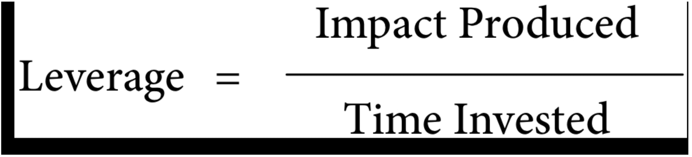

# Notes

## Definition of Leverage

Leverage is the return on investment (ROI) for the effort that’s put in.

Effective engineers aren’t the ones trying to get more things done by working more hours. They’re the ones who get things done efficiently—and who **focus their limited time on the tasks that produce the most value**.

## Increasing your leverage

Ask the following questions:

- what is my ultimate goal?
- Is this activity the most important thing to do?

- How can I complete this activity in a shorter amount of time?
  - Automating a manual process
  - Learning to use a new tool
- How can I increase the value produced by this activity?
  - Sharing the knowledge
- Is there something else that I could spend my time on that would produce more value?
